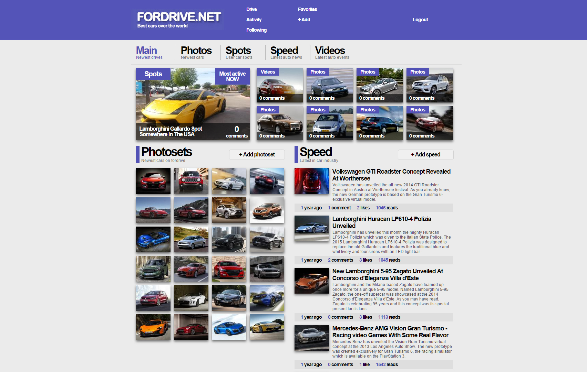
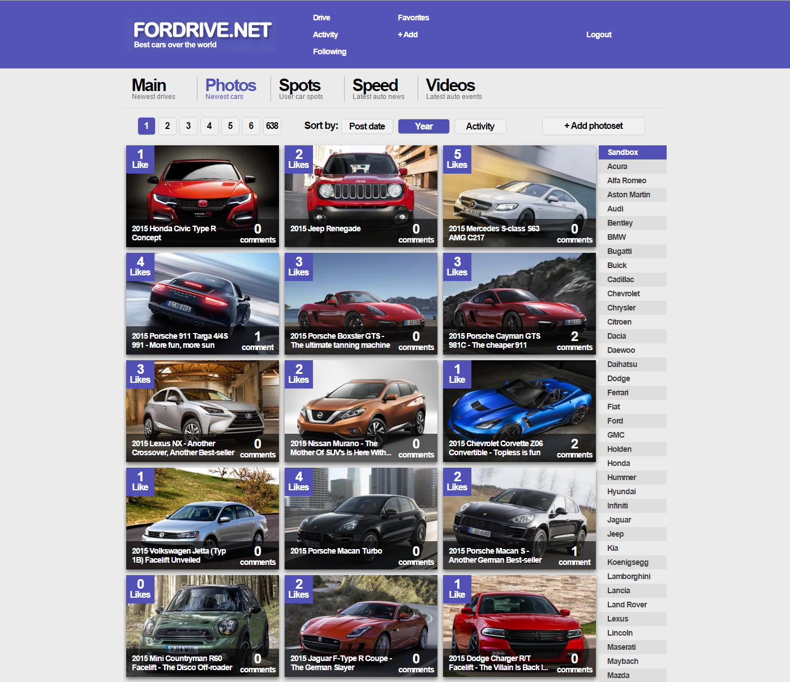
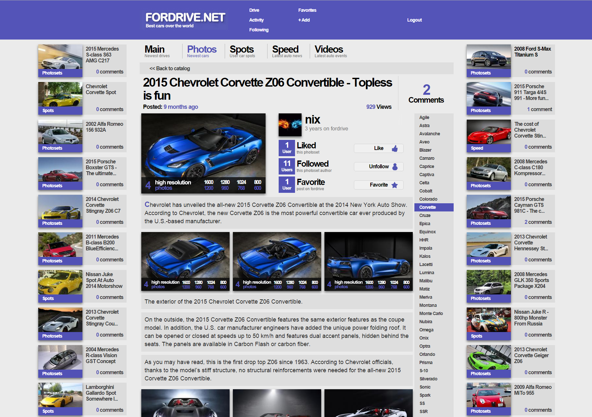
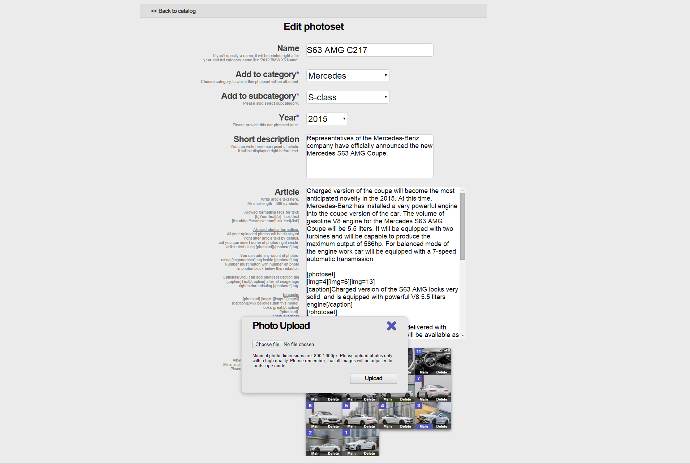
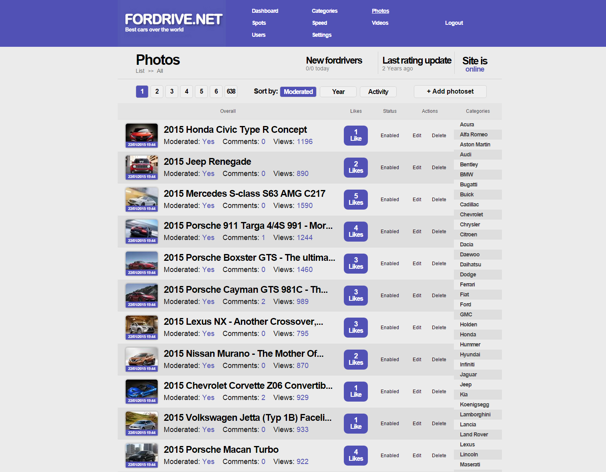

<div id="top"></div>

<!-- INTRO -->
<br />
<div align="center">
  <h3 align="center">(DEPRECATED) Basic MVC framework + website about cars</h3>

  <p align="center">
    One of my prev projects which I have successfully developed and used in 2012-2013. I have created basic MVC framework in plain PHP and released 5 commercial projects for my clients on top of it. This repo contains framework code + last project I have developed.(Automotive website with user-generated content) Later I have switched to Symfony framework instead of development own.
  </p>
</div>

<!-- FRAMEWORK STRUCTURE SHORT OVERVIEW -->
## Framework Structure Short Overview

### /public

Framework uses front controller pattern. All requests are redirected to /public folder and are handled by index.php file inside that folder. Short overview of index.php file structure:
  ```sh
  <?php
      // Define all base pathes for app
      define('CORE', ROOT . DS . 'core' . DS);
      // ...

      // Require all framework core classes
      require_once(CORE . 'config.php');
      // ...

      // All classnames are separated with underscore(_) char and have ClassName_ClassType format. 
      // Last part specifies class type like Model/Mapper/Controller. Loader requires required file with class. 
      function __autoload($class_name) 
      {
          Loader::load_class($class_name);
      }

      // Router processes current request
      Registry::set('router', new Router());

      // Closing file handles + db connection
  ```

/css and /js folder contains project stylesheet and script assets. Framework contains small asset processor, which merge css/js assets and dumps merged files into /css/compiled | /js/compiled dirs. 

### /config

* config.ini.php
  ```sh
  // contains core configuration data 
  [database]

  ;Database server
  db_server = localhost;
  // ...
  ```

* admin_routes.php / routes.php
  ```sh
  <?php
      // Contains routes for admin/public part of app
      // Routes are configured with simplex regexp-es: 
      $routes = array();

      // **********
      // *** drive page
      // **********    
      $module   = "(photos|spots|speed|photos)";
      $page     = "page-(\d+)";
      $category = "[^/]+-(\d+)";
    
      $routes[] = array(
          "drive/list/$module/$page/$category" => "drive/index/$1/$2/$3",
          "drive/list/$module/$page"           => "drive/index/$1/$2",
          "drive/list"                         => "drive/index"
      );

      // ...
  ```

### /core

Contains project base classes, like ajax, session, image, pagination, file upload, ... Most important ones:

* public_controller.php, admin_controller.php, controller.php:
  ```sh
  <?php
      // Base class of controller. All app controllers should extend it.
      abstract class Controller ...
      class Admin_Controller extends BaseController ...
      class Public_Controller extends Controller ...
  ```

* database.php:
  ```sh
  <?php
      class MySQL_Database
      {
          // ...
          public function open_connection() { ... }
          public function close_connection() { ... }
          public function query($sql) { ... }
          public function escape_value($value) { ... }
          // ...
  ```

* model.php:
  ```sh
  <?php
      // Base class of model. All app models should extend it. 
      // Framework implements ActiveRecord pattern to store data.
      // Models support 4 types of props:
      //     1) $db_fields = ["id", "parent_id", ...]; // Table fields
      //     2) $nested_db_fields = ["attached_items_count"]; 
      //        Stored in child table, but can be fetched directly from this model from nested select query
      //     3) $special_fields = ["license"]; // Part of this model logic which will not be used in db queries.
      //     4) $shared = [...]; // Used to work with other models 
      abstract class Model
      {
          // ...
          public function find_by_id($id = 0, $columns = "*")
          {
              $sql = "SELECT {$columns} FROM {$this->table_name} WHERE id=%d LIMIT 1";
              $sql = sprintf($sql, $this->database->escape_value($id));
            
              $result_array = $this->find_by_sql($sql); 
            
              return !empty($result_array) ? array_shift($result_array) : false;
          }
          // ...
  ```

* router.php:
  ```sh
  <?php
      // Application router. Gets URl and calls required controller
      class Router
      {
          // ...
          private function run_url()
          {
              // ...
              $controller = new $controller_name;
            
              if(method_exists($controller_name, $this->action))
              {
                  $controller->setRouterData($this->controller, $this->action);
                  $controller->before();
                  call_user_func_array(array($controller, $this->action), $this->controller_parametrs);
                  $controller->after();
              }
              else
              {
                  $error = new Error_Controller;
                  $error->show_404();
              }
          }
          // ...
  ```

* tags_parser.php / tags_scanner.php:
  ```sh
  <?php
      // Simple tags validator - ensures that all markdown tags are opened/closed correctly in text string,like: 
      // Lorem ipsum [b]ipsum[/b] lorem [photoset]...[/photoset]
      class Tags_Parser
      {
          // ...
  ```

* view.php:
  ```sh
  <?php
      // Wrapper for templates. Allows load templates from files(by pieces) + display in browser
      class View
      {
          // ...
          // Basic security - protection from xss
          private static function escape_xss($data = array(), $root_escape_key_exceptions = array())
          // Render view
          public static function capture($view_path, $view_data, $escape_xss = true, $root_escape_key_exceptions = array())
          // ...
  ```

<!-- APP STRUCTURE SHORT OVERVIEW -->
## App Structure Short Overview

### /application/controllers/

Contains public/admin controllers. Example:
  ```sh
  <?php
    class Account_Controller extends Public_Controller
    {
        public function create($request_type = "")
        {
            $this->is_ajax($request_type);
            $this->validate_token();
            
            $user = new User_Model;
            
            $user->bind($this->input->post("registration"));
            $user->validate(array(), "get_registration_fill_rules");
            // ...
            $this->model_errors->ajaxify_if_has_errors();

            if($user->save())
            {
                $email_html = View::capture("base" . DS . "activation_email", $data);
                // ...
                $this->ajax->render(); 
            }
        }
  ```

### /application/models/

Contains application models. Example:
  ```sh
  <?php
    class Photo_Model extends Model
    {
        protected $table_name = "photos";
        protected $db_fields  = array("id", "category_id", "user_id", "name", ...);
        protected $nested_db_fields = array("likes_count", "comments_count", "favorites_count", "views_count", ...);
        ...
        public $id;
        // other $db_fields
        ...
        public function find_all_photosets(...)
        {
            ...
            if($in_categories or $only_enabled or $only_moderated or $only_from_user_id)
            {
                $where_sql   = "WHERE ";
                $where_parts = array();
                
                ...
                $where_parts[] = ($only_from_user_id) ? sprintf(" user_id = %d ", $only_from_user_id) : "";
                
                $where_sql .= implode(" AND ", array_filter($where_parts));
            }
            else
            {
                $where_sql = "";
            }
            
            $this->pagination = new Pagination($page, $this->count($where_sql));
            if($validate_page) $this->pagination->validate_page_range(); 

            if(!$limit)
                $limit = $this->pagination->records_per_page;
            
            $photoset_stats_model = new Photo_Stats_Model;
            
            $photosets       = $this->get_table_name();
            $photosets_stats = $photoset_stats_model->get_table_name();
            
            $sql  = "SELECT $photosets.*,                                   ";
            $sql .= "       $photosets_stats.likes_count,                   ";
            ...
            
            if(in_array($sort, array("moderated", "year", "posted_on")))
            {
                $sql .= " FROM (                                        ";
                $sql .= "   SELECT * FROM $photosets                    ";
                $sql .= "   $where_sql                                  ";
                $sql .= "   ORDER BY $sort $direction, posted_on DESC   ";
                $sql .= "   LIMIT {$limit}                              ";
                $sql .= "   OFFSET {$this->pagination->offset}          ";
                $sql .= " ) AS $photosets                               ";
                $sql .= " INNER JOIN $photosets_stats                   ";
                $sql .= " ON $photosets_stats.photo_id = $photosets.id  ";
                $sql .= " ORDER BY $sort $direction, posted_on DESC     ";
            }
            ...

            return $this->find_by_sql($sql);
        }
  ```

### /application/views/

Contains application views. Example, file with list items:
  ```sh
<?php
    foreach($module_uploads as $module_upload):
?>
        <!-- Item -->
        <div class="item">
            <!-- Item wrapper -->
            <div class="item-wrapper">
                <?php echo $module_upload->some_props; ?>
            ...
<?php
    endforeach;
?>
  ```

<!-- WEBSITE OVERVIEW -->
## Website Overview

<div align="center">
  <h3 align="center">Website homepage</h3>
</div>

<a href="public/img/screen/1.jpg?raw=true">
  <p align="center">
    
  </p>
</a>

<div align="center">
  <h3 align="center">One of the main modules</h3>
</div>

<a href="public/img/screen/2.jpg?raw=true">
  <p align="center">
    
  </p>
</a>

<div align="center">
  <h3 align="center">View article page</h3>
</div>

<a href="public/img/screen/3.jpg?raw=true">
  <p align="center">
    
  </p>
</a>

<div align="center">
  <h3 align="center">Manage post page</h3>
</div>

<a href="public/img/screen/4.jpg?raw=true">
  <p align="center">
    
  </p>
</a>

<div align="center">
  <h3 align="center">Manage article admin page</h3>
</div>

<a href="public/img/screen/5.jpg?raw=true">
  <p align="center">
    
  </p>
</a>

<p align="right">(<a href="#top">back to top</a>)</p>